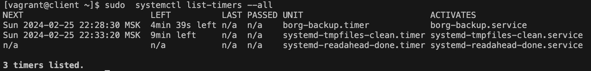

# Описание проекта

Настроен стенд Vagrant с двумя виртуальными машинами: backup_server и client.
Настроен удаленный бэкап каталога /etc c client при помощи borgbackup. Резервные копии соответствуют следующим критериям:  
- директория для резервных копий /var/backup. Является отдельной точка монтирования;
- репозиторий для резервных копий зашифрован паролем;
- имя бэкапа содержит информацию о времени снятия бекапа;
- глубина бекапа составляет год и хранит по последней копии на конец месяца, кроме последних трех. Последние три месяца содержат копии на каждый день;
- резервная копия снимается каждые 5 минут. Частата запуска выбрана в целях демонстрации;
- написан скрипт для снятия резервных копий. Скрипт запускается systemd timer-а.

Для развертываня стенда использован Vagrantfile, запуск которого осуществляется командой  ```vagrant up``` 
После запуска стенда, его конфигурация осуществляется с помощью ansible запуском команды ```ansible-playbook ./ansible/playbook.yml -i ./ansible/hosts.ini```
Что бы убедится в том, что резервные копии выполняются необходимо выполнить команду на client ```sudo  systemctl list-timers --all```, ее вывод должен соответствовать приведенному на скриншоте ниже:
